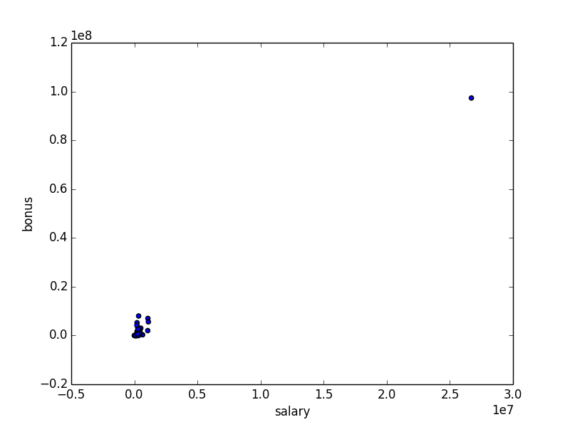
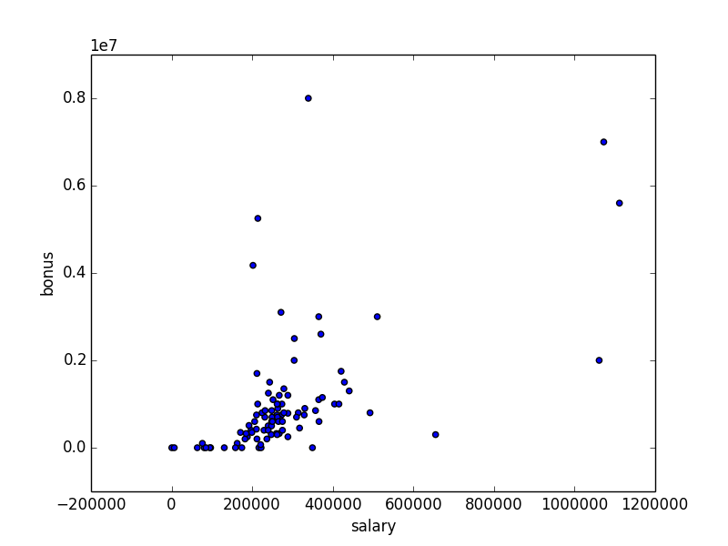
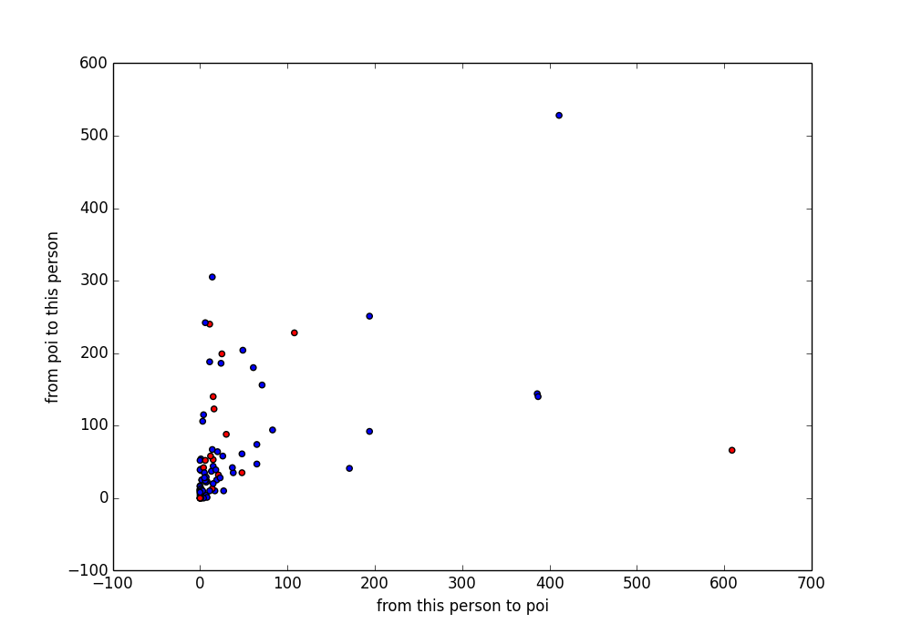
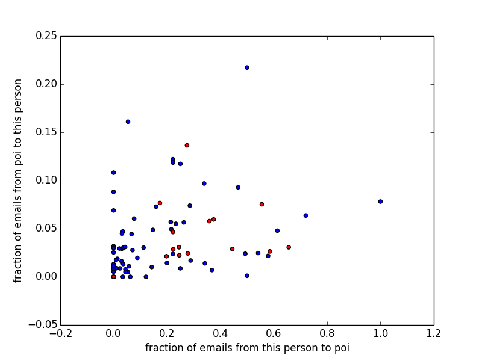

# Identify Fraud from Enron Email

## Overview

This project is to use machine learning skills to identify Enron Employees who may have committed fraud based on the public Enron financial and email dataset. It's an end-to-end process of investigating data through a machine learning lens.

## Data Exploration

- Features

	The features in the data fall into three major types, namely financial features, email features and POI labels. financial features: ['salary', 'deferral_payments', 'total_payments', 'loan_advances', 'bonus', 'restricted_stock_deferred', 'deferred_income', 'total_stock_value', 'expenses', 'exercised_stock_options', 'other', 'long_term_incentive', 'restricted_stock', 'director_fees'] (all units are in US dollars) email features: ['to_messages', 'email_address', 'from_poi_to_this_person', 'from_messages', 'from_this_person_to_poi', 'poi', 'shared_receipt_with_poi']

- Total no. of data points

	146

- Allocation across classes(POI/non-POI)

	18/128

- Outliers

	After plotting the salary and bonus scatterplot, one outlier called "TOTAL" immediately poped out. It's removed as a spreadsheet quirk.

	

	After removing the outlier, although some other points have very large value, they are valid data points and may indicate some difference between poi and non-poi.

	


## Feature Selection

### Adding new features

- After plotting the number of emails from this person to poi vs the number of emails to this person from poi, I don't see any pattern between the red points(poi) and the blue points(non-poi).

	

	But since we already got the number of emails from/to poi and the total number of from/to emails of each person, I've the strong intuition that the fraction of emails to this person from poi and from this person to poi might be helpful. So two new features named "fraction_to_poi" and "fraction_from_poi" are added in my dataset. From the new plot, we can see the red points(poi) tend to cluster in the middle of the graph.

	

- Also I think the content of emails may reveal difference between poi and non-poi.
  - First, I extract features from all the email text data and create labels based on whether the author is poi or not.
  - Then I use naive bayes to create a classification and fit the above data.
  - Finally I use that classification to make prediction on each person's email text file. The new feature is the prediction result and is named "text_learn_pred"(the helper methods for the above process are in extract_email.py, poi_by_email.py and poi_id.py files).

### Univariate Feature Selection
First, I tried each feature with GaussianNB and rank these features by the f1 score. The result as follow:

```
(feature_name,precision,recall,f1)
('total_stock_value', 0.6325842696629214, 0.2815, 0.38961937716262973)
('exercised_stock_options', 0.5232342007434945, 0.2815, 0.3660598179453836)
('bonus', 0.5297549591598599, 0.227, 0.3178158907945397)
('deferred_income', 0.5125148986889154, 0.215, 0.302923564635435)
('restricted_stock_deferred', 0.15070454374199382, 1.0, 0.26193438543644815)
('director_fees', 0.149947518368571, 1.0, 0.26079019428869477)
('long_term_incentive', 0.5395569620253164, 0.1705, 0.2591185410334346)
('fraction_to_poi', 0.286203941730934, 0.167, 0.210925165772024)
('salary', 0.535632183908046, 0.1165, 0.19137577002053388)
('restricted_stock', 0.5065217391304347, 0.1165, 0.18943089430894308)
('total_payments', 0.43796992481203006, 0.1165, 0.18404423380726698)
('loan_advances', 0.54337899543379, 0.0595, 0.10725552050473186)
('text_learn_pred', 0.49122807017543857, 0.056, 0.10053859964093358)
('other', 0.2916666666666667, 0.0595, 0.09883720930232558)
('from_this_person_to_poi', 0.1925566343042071, 0.0595, 0.09090909090909091)
('shared_receipt_with_poi', 0.1731748726655348, 0.051, 0.07879490150637311)
('deferral_payments', 0, 0, 0)
('expenses', 0, 0, 0)
('to_messages', 0, 0, 0)
('from_poi_to_this_person', 0, 0, 0)
('from_messages', 0, 0, 0)
('fraction_from_poi', 0, 0, 0)
```

We can see, based on the f1 score, the top 10 most important features are ['total_stock_value','exercised_stock_options','bonus','deferred_income','restricted_stock_deferred','director_fees','long_term_incentive','fraction_to_poi','salary','restricted_stock'].

Of all the three newly added features, 'fraction_to_poi' is quite an important features in those email features. For some reasons, the true positive number is zero for 'fraction_from_poi' feature, so all the metrics results are invalid for that feature. Also, the added 'text_learn_pred' feature don't perform well in both precision and recall.

Second, I try to combine those best features in the above result form. With the number of K increases, below is the result for the K best features combination:

```
(k,precision,recall,f1)
(1, 0.6325842696629214, 0.2815, 0.38961937716262973)
(2, 0.43779160186625193, 0.2815, 0.34266585514303105)
(3, 0.4398148148148148, 0.3325, 0.3787015945330296)
(4, 0.5112285336856011, 0.387, 0.44052361980648835)
(5, 0.15070454374199382, 1.0, 0.26193438543644815)
(6, 0.1668613382279326, 1.0, 0.286000286000286)
(7, 0.1668613382279326, 1.0, 0.286000286000286)
(8, 0.1668613382279326, 1.0, 0.286000286000286)
(9, 0.1668613382279326, 1.0, 0.286000286000286)
(10, 0.1668613382279326, 1.0, 0.286000286000286)
```

From the result we see that when K is greater than or equal to five, the recall value is always 1. This means the 'restricted_stock_deferred' feature is too strong for the fit and it causes overfitting. Also, from the first result, we can see 'director_fees' is also a feature that will cause bias. So I remove these two features and repeat second step. Result as follow:

```
(k,precision,recall,f1)
(1, 0.6325842696629214, 0.2815, 0.38961937716262973)
(2, 0.43779160186625193, 0.2815, 0.34266585514303105)
(3, 0.4398148148148148, 0.3325, 0.3787015945330296)
(4, 0.5112285336856011, 0.387, 0.44052361980648835)
(5, 0.5184192900200938, 0.387, 0.44317205840251933)
(6, 0.5184192900200938, 0.387, 0.44317205840251933)
(7, 0.4831056793673616, 0.336, 0.3963432615747567)
(8, 0.4801488833746898, 0.387, 0.42857142857142855)
(9, 0.41869158878504675, 0.336, 0.37281553398058254)
(10, 0.5118050266565118, 0.336, 0.4056746151524298)
```

From the result, the combination of top 5 features provide the best outcome in both precision and recall. So my final feature choice is ['total_stock_value','exercised_stock_options','bonus','deferred_income','long_term_incentive']. Although new features are added in my dataset, all of them are not selected.

### Algorithms
features:['total_stock_value','exercised_stock_options','bonus','deferred_income','long_term_incentive']
#### Gaussian Naive Bayes
```python
from sklearn.naive_bayes import GaussianNB
clf = GaussianNB()
```

GaussianNB()

Accuracy: 0.84929	Precision: 0.46734	Recall: 0.39350	F1: 0.42725	F2: 0.40634

Total predictions: 14000	True positives:  787	False positives:  897	False negatives: 1213	True negatives: 11103

#### Decision Trees
```python
from sklearn import tree
clf = tree.DecisionTreeClassifier()
```

DecisionTreeClassifier(class_weight=None, criterion='gini', max_depth=None,
            max_features=None, max_leaf_nodes=None, min_samples_leaf=1,
            min_samples_split=2, min_weight_fraction_leaf=0.0,
            random_state=None, splitter='best')

Accuracy: 0.80679	Precision: 0.31612	Recall: 0.30300	F1: 0.30942	F2: 0.30554

Total predictions: 14000	True positives:  606	False positives: 1311	False
	negatives: 1394	True negatives: 10689

feature importance:

[ 0.25121296  0.17351844  0.25902441  0.19439786  0.12184633]

#### K-Nearest Neighbors
```python
from sklearn.neighbors import KNeighborsClassifier
clf = KNeighborsClassifier()
```

Pipeline(steps=[('scale', StandardScaler(copy=True, with_mean=True, with_std=True)), ('knn', KNeighborsClassifier(algorithm='auto', leaf_size=30, metric='minkowski',
           metric_params=None, n_neighbors=5, p=2, weights='uniform'))])

Accuracy: 0.85021	Precision: 0.35860	Recall: 0.06150	F1: 0.10499	F2: 0.07371

Total predictions: 14000	True positives:  123	False positives:  220	False negatives: 1877	True negatives: 11780

As KNN call for scaling as it is based on Euclidean distances, here a StandardScaler is called to preprocessing the data.

## Tune the Algorithm
The machine learning algorithms are parameterized so that their behavior can be tuned for a given problem. It's important to perform parameter tuning here to adjust the precision and recall. In order to get the best result in identifying person of interest, I will use grid search to automatically tune the algorithm.


### Tune KNN
The principle behind nearest neighbor methods is to find a predefined number of training samples closest in distance to the new point, and predict the label from these.

Tune feature:

- Number of neighbors to use
- Algorithm used to compute the nearest neighbors

```python
knn = KNeighborsClassifier()
# feature scale
estimators = [('scale', StandardScaler()), ('knn', knn)]
pipeline = Pipeline(estimators)
parameters = {'knn__n_neighbors':[1,8],
	'knn__algorithm':('ball_tree','kd_tree','brute','auto')}
clf = GridSearchCV(pipeline, parameters,scoring = 'precision')
```

best_params:{'knn__algorithm': 'ball_tree', 'knn__n_neighbors': 1}

result:

Accuracy: 0.79721	Precision: 0.22635	Recall: 0.17350	F1: 0.19643	F2: 0.18200

Total predictions: 14000	True positives:  347	False positives: 1186	False negatives: 1653	True negatives: 10814

### Tune Decision Tree
The goal of the decision tree is to create a model that predicts the value of a target variable by learning simple decision rules inferred from the data features.

Tune feature:
- criterion(the function to measure the quality of a split)
- splitter(the strategy used to choose the split at each node)

```python
tree_clf = tree.DecisionTreeClassifier()
parameters = {'criterion':('gini', 'entropy'),
	'splitter':('best','random')}
clf = GridSearchCV(tree_clf, parameters,scoring = 'recall')
test_classifier(clf, my_dataset, features_list)
```

best_params:{'splitter': 'random', 'criterion': 'entropy'}

result:

Accuracy: 0.80307	Precision: 0.30256	Recall: 0.29000	F1: 0.29615	F2: 0.29243

Total predictions: 14000	True positives:  580	False positives: 1337	False negatives: 1420	True negatives: 10663

## Result
|algorithm|precision|recall|
|---|---|---|
|GaussianNB()|0.46|0.39|
|KNeighborsClassifier(algorithm = 'ball_tree', n_neighbors = 1)|0.23|0.17|
|DecisionTreeClassifier(criterion = 'entropy',splitter = 'random')|0.30|0.29|

Based on the result, Gaussian Naive Bayes is selected as the final algorithm.

## Validate and Evaluate
### Validation
The cross validation process helps us to get the estimate performance of a independent data and serves as a check on overfitting. The goal is to define a dataset to "test" the model in the training phase. Because of the small size of the dataset, stratified shuffle split cross validation is used. StratifiedShuffleSplit also keeps the ratio of POI/non-POI the same as it was in the original data set. A classic mistake to make a wrong validation is to split the sorted data without shuffling.

### Evaluation
#### Precision
Avg: 0.46

Precision is also referred to as positive predictive value. It's calculated as True Positive/(True Positive + False Positive). In here it means the proportion of the correct prediction of all the people who are predicted to be poi.

#### Recall
Avg: 0.39

Recall is also referred to as the true positive rate or sensitivity. It's calculated as True Positive/(True Positive + False Negative). In here it means the proportion of the poi the model can detect of all the poi.
For fraud prediction models, higher recall is generally preferred even if some precision is sacrificed.

## Reference
<https://en.wikipedia.org/wiki/Precision_and_recall>

<http://nerds.airbnb.com/designing-machine-learning-models/>

<https://en.wikipedia.org/wiki/Cross-validation_(statistics)>
